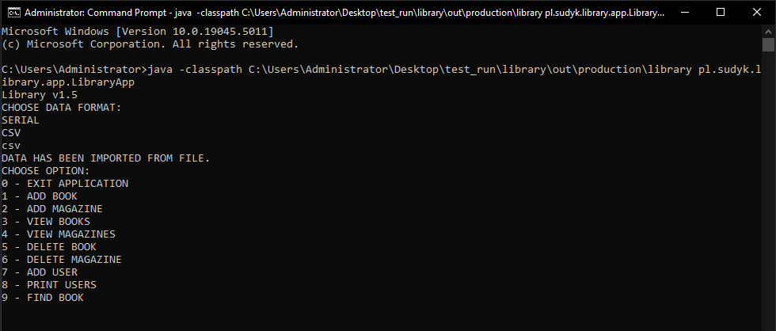

# Library Management Console Application

The **Library Management Console Application** is a simple and efficient program designed to manage a library's data. The application allows users to:

- Add books, magazines, and users.
- Display the library's data (books, magazines, users) in the console.
- Save and load the library's state either via:
    - CSV files.
    - Serialized object files (`Library.o`).



## Features

1. **Book Management**
    - Add books to the library collection.
    - View a list of all books.

2. **Magazine Management**
    - Add magazines to the library collection.
    - View a list of all magazines.

3. **User Management**
    - Register library users.
    - View a list of registered users.

4. **Data Persistence**
    - Save library data to a CSV file for easy readability.
    - Save library data as a serialized object for faster loading and secure storage.

5. **Console-based Interface**
    - Interact with the application using a simple, text-based interface.

## Requirements

- Java Development Kit (JDK) version 8 or higher.
- Any platform that supports Java.

## How to Run

1. Clone the repository to your local machine:
   ```bash
   git clone https://github.com/sudyk1/library.git
   java -classpath C:\*** your_path ***\library\out\production\library pl.sudyk.library.app.LibraryApp 
   